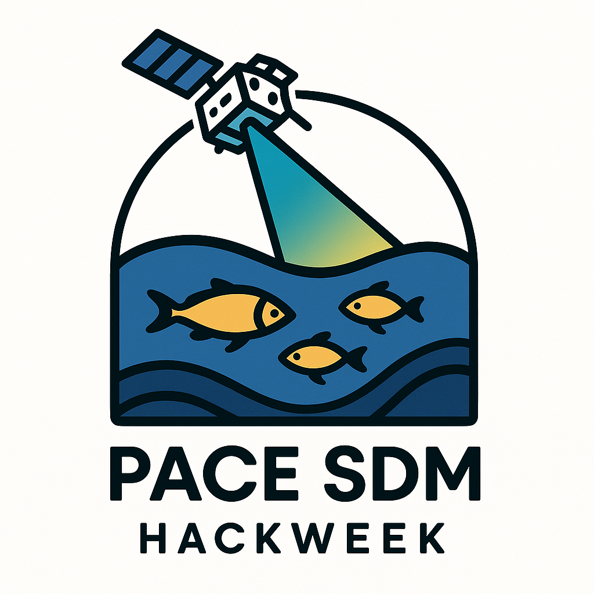

# PACE SDM TEAMS

<table style="width:100%">
  <tr>
    <td style="width:50%; vertical-align: top;">
      
    </td>
    <td style="width:50%; vertical-align: top;">
      Our project is to develop a basic workflow for Species Distribution Modeling (SDMs) and Boosted Regression models using PACE data as predictors. The goal is to collaborate on getting the basic steps programmed using 3 projects in 3 different regions as motivation.
    </td>
  </tr>
</table>

### Projects

* Chesepeake Bay oxygen: Oxygen front
* Gulf of Maine squids: Shelf Science Squidsters
* Canary Current upwelling region sardines: FishTok Guinea

### Collaborators

List all participants on the project. Here is a good space to share your personal goals for the hackweek and things you can help with.

| Name | Team|  GitHub | Things I bring | Affiliation |
| ------------- | ------------- | ------------- | ------------- | ------------- |
| Artem Dzhulai |   |  |  |   |
| Dante Horemans | Chesepeake |  |  |   |
| [Eli Holmes](https://eeholmes.github.io/) | Floater | [eeholmes](https://github.com/eeholmes) | Project Helper; Git; Python; SDMs | NOAA; Univ of Wash; OceanHackWeek |
| Frederic Bonou | Guinea |  |   |  |
| Jiang |  |   |  |
| Jing Tan |  |   |  |
| Natalie McCourt | NES |  [spacenatalie](https://spacenatalie.github.io/) | Python, Git, netCDF | UMBC
| Sajna Hussain |  |   |  |
| Punya P |  |   |  |
| [Haley Synan](https://www.fisheries.noaa.gov/contact/haley-synan) | NES | [hsynan](https://github.com/hsynan) | Python, ML, general oceanography | NOAA Fishers/IBSS 

## Data and Methods

### Response Data

We need observations of presence/absence, abundance, or level (oxygen) with date/time, lat, lon. We need a large number of points distributed across a variety of regions in our study regions.

### Explanatory Data

Plan to explore PACE products.

* Light penetration. We'd need to compute.

### Proposed methods/tools

XBoost

### Additional resources or background reading

Optional: links to manuscripts or technical documents providing background information, context, or other relevant information.

### Tasks

* Sunday - organize and get on GitHub
* Tuesday - get our observation data together
* Wednesday - get our response data together
* Thursday - get XBoost working
* Friday - put presentation together

## Project Results

